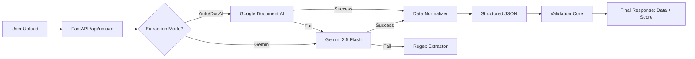

# Invoice QC Service & Extraction Pipeline

A robust, full-stack solution for automated invoice data extraction and quality control. This system leverages a "Hybrid AI" approach, combining the structured precision of **Google Document AI**, the cognitive flexibility of **Google Gemini 2.5 Flash**, and traditional **Regex-based** parsing to ensure high-accuracy data capture.

## Video Demo
[Watch the Video Walkthrough](https://drive.google.com/file/d/1U9xi__rtYbZoFtm7eslP10wlDq-PTCSL/view?usp=sharing)

---

## 8. Deliverables

### 8.1. GitHub Repository Structure

The project is organized into modular components:

- **`backend/`**: Contains the core logic (API, Extraction, Validation, CLI).
- **`frontend/`**: A modern, responsive web interface.
- **`README.md`**: This documentation file.
- **`VALIDATION_RULES.md`**: Detailed breakdown of validation logic.
- **`requirements.txt`**: Python dependencies.

### 8.2. Detailed Project Documentation

---

## 1. Overview

**What we built:**
An end-to-end **Invoice Extraction & Validation Service** that transforms unstructured PDF invoices into structured, validated JSON data.

**Key Components Completed:**
1.  **Extraction Module**: A multi-engine pipeline supporting **Google Document AI** (primary), **Gemini 2.5 Extraction** (vision/text fallback), and **PDF Extractor** (regex backup).
2.  **Validation Core**: A rule-based engine that checks for data integrity (totals matching, date formats, required fields).
3.  **API Service**: A **FastAPI** backend providing endpoints for file upload (`/api/upload`) and batch processing.
4.  **CLI**: A command-line interface for bulk processing files directly from the terminal.
5.  **Frontend**: A polished, dark-mode-enabled Web UI for users to upload files, view PDF previews, and inspect extracted data side-by-side.

---

## 2. Schema & Validation Design

The data schema is defined using **Pydantic** models to ensure type safety.

### **Core Fields (`InvoiceSchema`)**
| Field | Type | Description |
| :--- | :--- | :--- |
| `invoice_number` | String | Unique identifier for the invoice. |
| `invoice_date` | Date | The date the invoice was issued (YYYY-MM-DD). |
| `due_date` | Date | The payment deadline. |
| `vendor_name` | String | Name of the supplier/vendor. |
| `vendor_address` | String | Physical address of the vendor. |
| `total_amount` | Float | Grand total including tax. |
| `tax_amount` | Float | Total tax value. |
| `subtotal` | Float | Amount before tax. |
| `currency` | String | Currency code (e.g., USD, EUR). |
| `line_items` | List | Detailed list of purchased items (qty, description, price, total). |

### **Validation Rules**
*Rationale: To ensure financial accuracy and compliance.*

1.  **Confidence Check**: Warn if extraction confidence < 80%.
2.  **Required Fields**: `invoice_number`, `date`, `total_amount`, and `vendor_name` MUST be present.
3.  **Arithmetic Consistency**: `Subtotal + Tax` must equal `Total Amount` (within a small float tolerance).
4.  **Date Logic**: `Due Date` cannot be earlier than `Invoice Date`.
5.  **Line Item Integrity**: Sum of individual line totals must match the invoice `Subtotal`.

---

## 3. Architecture

### **Folder Structure**
```
project/
├── backend/
│   ├── cli.py                   # Command Line Interface
│   ├── main.py                  # FastAPI Application Entry
│   ├── models.py                # Pydantic Schemas
│   ├── validator.py             # Validation Logic Core
│   ├── document_ai_extractor.py # Google Document AI Logic
│   ├── enhanced_pdf_extractor.py# Gemini 2.5 Flash Logic
│   ├── pdf_extractor.py         # Regex/PyMuPDF Fallback Logic
│   ├── extraction_merger.py     # Strategy Selector (Auto Mode)
│   ├── logs/                    # Application logs
│   └── requirements.txt         # Backend Dependencies
├── frontend/
│   ├── index.html               # Main UI Page
│   ├── app.js                   # Frontend Logic
│   └── styles.css               # Styling (Dark Mode, layout)
└── README.md                    # Documentation
```

### **System Flow**
The system uses a fallback strategy known as **"Auto Mode"**:



---

## 4. Setup & Installation

### **Prerequisites**
- **Python 3.10+** installed.
- **Google Cloud Project** with:
    - Document AI API enabled.
    - Vertex AI (Gemini) API enabled.
- Service Account JSON key.

### **Installation**
1.  **Clone the Repo**:
    ```bash
    git clone https://github.com/csvinay/invoice-qc-service.git
    cd invoice-qc-service/project
    ```

2.  **Setup Backend**:
    ```bash
    cd backend
    python -m venv venv
    # Windows
    venv\Scripts\activate
    # Mac/Linux
    # source venv/bin/activate
    
    pip install -r requirements.txt
    ```

3.  **Environment Configuration**:
    Create a `.env` file in the `backend/` directory:
    ```ini
    GOOGLE_APPLICATION_CREDENTIALS="path/to/your/service-account.json"
    GOOGLE_CLOUD_PROJECT="your-project-id"
    GOOGLE_DOCUMENT_AI_LOCATION="us"
    GOOGLE_DOCUMENT_AI_PROCESSOR_ID="your-processor-id"
    GEMINI_API_KEY="your-gemini-api-key" (Optional if using Vertex AI credentials)
    # Feature Flags
    ENABLE_DOCUMENT_AI=false (Default: false. Set to true to enable Premium Document AI)
    ```

    *Note: Google Document AI is treated as a premium feature requiring Google Cloud billing. It is disabled by default.*

---

## 5. Usage

### **5.1. Running the API**
Start the backend server using Uvicorn:
```bash
# Inside backend/ directory
uvicorn main:app --reload --host 0.0.0.0 --port 8000
```
Swagger Documentation will be available at: `http://localhost:8000/docs`

### **5.2. Running the Frontend**
Serve the simple HTML frontend:
```bash
# Inside frontend/ directory
python -m http.server 3000
```
Visit `http://localhost:3000` in your browser.

### **5.3. Using the CLI**
The project includes a robust CLI in `backend/cli.py`.

**Extract from a single file:**
```bash
python cli.py extract "path/to/invoice.pdf" --method auto
```

**Bulk Process a Directory:**
```bash
python cli.py process-batch "./invoices_folder" --output "./results.json"
```

**Run Validation Only:**
```bash
python cli.py validate "extracted_data.json"
```

---

## 7. AI Usage Notes & Guidelines

This project was built with the assistance of AI tools to accelerate development while maintaining manual oversight for critical logic.

### **Tools Used**
*   **Google DeepMind / Antigravity**: Primary pair-programmer for full-stack implementation, debugging, and documentation.
*   **LLMs (General)**: Used for generating initial boilerplate code for FastAPI and regex patterns for the fallback PDF extractor.

### **Areas of AI Assistance**
1.  **Scaffolding**: Rapid generation of folder structures and standard file boilerplate (`main.py`, `models.py`).
2.  **Regular Expressions**: Generating complex regex patterns for identifying dates and invoice numbers in the fallback extractor.
3.  **Frontend Logic**: Drafting the `app.js` logic for handling file uploads and updating the DOM dynamically.
4.  **Documentation**: Summarizing the project architecture and generating the Mermaid.js diagram for the system flow.

### **Failure Case & Manual Correction**
**Incident**: Dark Mode UI Theming
*   **AI Suggestion**: The AI suggested a standard CSS variable swap for dark mode (`--bg-primary: #000`).
*   **Limitation**: The AI failed to account for browser-specific user agent styles on `<select>` dropdown elements, resulting in unreadable "white-on-white" text in the "Extraction Mode" menu.
*   **Manual Fix**: We manually debugged the specific CSS specificity issues and applied `!important` overrides to the `option` elements to enforce the correct background/foreground contrast.

*Detailed logs of these interactions can be found in the `/ai-notes/` directory.*

---

## 7. Assumptions & Limitations

-   **PDF Focus**: The current implementation is optimized for PDF documents. Images (JPG/PNG) are supported via Gemini Vision but might require conversion for the primary Document AI processor if not configured for OCR.
-   **Single Currency**: While the schema has a `currency` field, complex multi-currency conversion logic is currently out of scope.
-   **Local Deployment**: The `README` assumes a local environment. For production (e.g., Render/Heroku), ensure `GOOGLE_APPLICATION_CREDENTIALS` are handled via secure environment variables or base64 encoding, not file paths.

---

